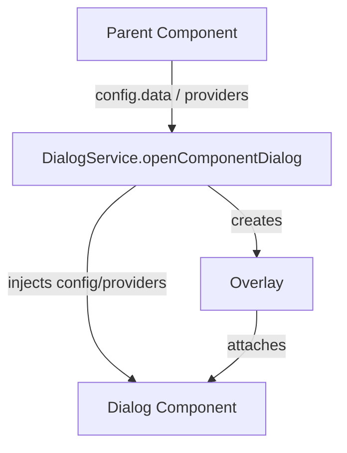
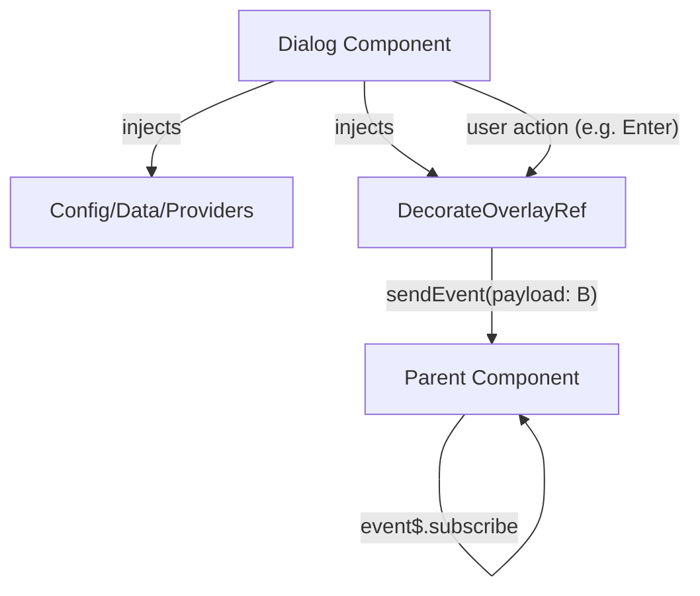

# Dialog 開發者實作細節

這份文件給「維護者」或「進階開發者」看，專注於 DialogService 與相關元件的實作、架構、型別安全、DI、工具與進階細節。

---

## 架構與流程

### 關鍵元件

- DialogService：彈窗 API 與 Overlay 管理
- DialogComponentConfig / DefaultDialogConfig：彈窗設定
- WebFeaturesDialogComponent：預設彈窗 UI
- DecorateOverlayRef：彈窗參考與事件流
- Providers/Utils：依賴注入與 Overlay 工具

### 流程圖

#### 1. 父元件創立 dialog 並注入資料



#### 2. DialogComponent 取得資料並回傳型別安全資料給父元件



---

## 依賴注入（DI）說明

Dialog 的 DI（Dependency Injection）設計讓你能彈性注入各種資料、設定、甚至 service 到 Dialog 內部元件。這是 Angular 溝通與擴充的核心。

### 內建 Provider 說明

- **DIALOG_DEFAULT_PROVIDER**：DialogService 會自動用這個 token 注入 DefaultDialogConfig
- **DIALOG_COMPONENT_PROVIDER**：DialogService 會自動用這個 token 注入 DialogComponentConfig

### 典型用法

DialogService 會自動把 config 用 provider 注入 overlay，DialogComponent 只要用 @Inject(TOKEN) 就能拿到 config。

```typescript
// dialog.provider.ts 內部
export const DIALOG_DEFAULT_PROVIDER = new InjectionToken<DefaultDialogConfig>('DIALOG_DEFAULT_PROVIDER');
export const DIALOG_COMPONENT_PROVIDER = new InjectionToken<DialogComponentConfig>('DIALOG_COMPONENT_PROVIDER');

// DialogService 會自動這樣注入
const dialogProvider = { provide: DIALOG_DEFAULT_PROVIDER, useValue: config };
const dialogComponentProvider = { provide: DIALOG_COMPONENT_PROVIDER, useValue: config };

// DialogComponent 只要這樣拿到 config
@Component({...})
export class MyDialog {
  constructor(@Inject(DIALOG_COMPONENT_PROVIDER) public config: DialogComponentConfig) {}
}
```

### 自訂資料 Token

你可以自訂 InjectionToken 傳遞任何資料或 service：

```typescript
// 定義自訂 Token
export const MY_TOKEN = new InjectionToken<MyType>('MY_TOKEN');

// 傳入 provider
const providers = [{ provide: MY_TOKEN, useValue: { foo: 'bar' } }];
const ref = dialogService.openComponentDialog(config, providers);

// Dialog 內注入
@Component({...})
export class MyDialog {
  constructor(@Inject(MY_TOKEN) public data: any) {}
}
```

### DI 實作重點

- 這些 provider 實作在 dialog.provider.ts
- 你可以用同樣方式傳遞任何資料或 service
- DialogService 會自動處理 config 注入，進階用戶可自訂 provider

---

# 工具與 Utilities

這些 utilities 是 DialogService 內部的核心，讓彈窗能彈性擴充、客製化。你可以直接用來打造自己的 Dialog 行為。

## overlay-ref-builder.util.ts

- 用來建立與設定 Angular CDK 的 OverlayRef
- 封裝 overlay 建立、關閉、事件流等細節
- 讓 DialogService 可以快速產生 overlay 實例

## overlay-position-builder.util.ts

- 提供 overlay 位置策略（如置中、客製位置）
- 你可以用它自訂彈窗出現的位置

## decorate-overlay-ref.ts

- 將 OverlayRef 包裝成 DecorateOverlayRef
- 提供 event$ 事件流，讓 Dialog 內外能用 RxJS 溝通
- 支援 sendEvent、close 等自訂方法

### 內部運作範例

```typescript
import { createRefBuilder, createRefInjector } from 'web/features/dialog';
const refBuilder = createRefBuilder(positionBuilder, overlay);
const refInjector = createRefInjector(injector);
```

- DialogService 會用這些 util 產生 overlay、注入 provider、建立事件流
- 你也能直接用這些工具做進階彈窗

---

# Dialog 資料注入與型別安全回傳

## 如何將資料 DI 進 DialogComponent

Dialog 支援多種方式將資料注入 DialogComponent：

1. config.data 欄位（最常用）
2. @Inject(`DIALOG_COMPONENT_PROVIDER`) 取得完整 DialogComponentConfig
3. 自訂 InjectionToken 傳遞任意資料或 service

## DI 範圍與多 Dialog 實例

- 每次呼叫 openComponentDialog 都會產生一個獨立的 Dialog overlay 與 DI context。
- 每個 DialogComponent inject DIALOG_COMPONENT_PROVIDER 時，拿到的都是自己那份 config，不會跟其他 dialog 實例共用或干擾。
- 就算同時開多個 dialog，每個 dialog 的 component 都會各自 inject 到自己那份 DialogComponentConfig。
- 這是 Angular DI 的作用範圍（scope）機制，overlay 會有自己的 injector，保證資料隔離。

---

### config.data 範例

```typescript
// 父元件
const config: DialogComponentConfig = {
  injectorID: 'my-dialog',
  componentRef: () => MyDialogComponent,
  overlayConfig: DEFAULT_OVERLAY_CONFIG,
  data: { foo: 'bar', id: 123 },
};
const ref = dialogService.openComponentDialog<MyPayload>(config);

// DialogComponent 內部
export class MyDialogComponent {
  constructor(@Inject(DIALOG_COMPONENT_PROVIDER) public config: DialogComponentConfig) {}
  ngOnInit() {
    // 取得 data
    const foo = this.config.data.foo;
  }
}
```

#### 自訂 InjectionToken 範例

```typescript
// 定義 Token
export const MY_DIALOG_DATA = new InjectionToken<MyType>('MY_DIALOG_DATA');

// 父元件
const providers = [{ provide: MY_DIALOG_DATA, useValue: { foo: 'bar' } }];
const ref = dialogService.openComponentDialog<MyPayload>(config, providers);

// DialogComponent 內部
export class MyDialogComponent {
  constructor(@Inject(MY_DIALOG_DATA) public data: MyType) {}
}
```

---

## Dialog 回傳資料給父元件（型別安全）

- DialogComponent 內部 inject DecorateOverlayRef<T>，T 為回傳型別
- 用 sendEvent({ type, data }) 回傳資料，型別自動檢查
- 父元件用 openComponentDialog<T>()，T 為回傳型別，event$ 會自動推論

#### 回傳型別與注入型別分離

- config.data: 傳入型別（A）
- openComponentDialog<B>(config): 回傳型別（B）
- DialogComponent 可同時 inject config.data (A) 與 DecorateOverlayRef<B>

#### 範例

```typescript
// 型別定義
interface DialogInput { id: string; foo: string; }
interface DialogOutput { result: string; }

// 父元件
const config: DialogComponentConfig = {
  injectorID: 'my-dialog',
  componentRef: () => MyDialogComponent,
  overlayConfig: DEFAULT_OVERLAY_CONFIG,
  data: { id: 'abc', foo: 'bar' },
};
const ref = dialogService.openComponentDialog<DialogOutput>(config);
ref.event$.subscribe(event => {
  // event.data 型別自動是 DialogOutput
  if (event.type === DialogEvent.Enter) {
    console.log(event.data.result);
  }
});

// DialogComponent 內部
export class MyDialogComponent {
  constructor(@Inject(DIALOG_COMPONENT_PROVIDER) public config: DialogComponentConfig)
  #ref = inject(DecorateOverlayRef<DialogOutput>);
  onConfirm() {
    this.#ref.sendEvent({ type: DialogEvent.Enter, data: { result: 'done' } });
  }
}
```

---

## 小結

- DI 與型別安全設計確保彈窗資料流隔離、型別明確
- Utilities 讓進階用戶可自訂 overlay/ref/事件流
- 所有 API、型別、事件流皆有型別推論與完整 DI 支援
